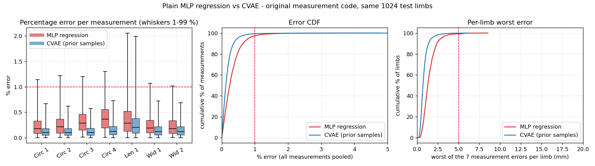
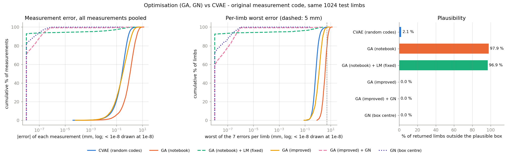

# Generating residual-limb shapes from clinical measurements

**In one sentence:** I trained a neural network that takes the seven tape and caliper measurements a clinician records and generates many different, plausible 3-D residual-limb shapes. Every one of those shapes has the requested measurements.

---

## 1. Summary of findings

1. **Generated limbs have the requested measurements.** The mean error is 0.37 mm (0.17 %). Only 0.1 % of generated limbs have any measurement more than 5 mm off.
2. **This is about 2× more accurate than a plain MLP regressor of identical architecture trained on the same data** (0.37 vs 0.72 mm on the same 1024 test limbs), and 4× more accurate than the genetic algorithm (GA) as configured in the notebook (1.54 mm). **Repaired optimisation is more accurate than the CVAE, however:** Gauss–Newton constrained to OpenLimbTT's plausible region matches the measurements essentially exactly (mean 0.0001 mm), with every limb plausible, in about 0.1 s per limb (§8.3). The CVAE's advantages over it are speed (0.6 ms for 64 limbs, against ~7 s) and a learnt family. The plain MLP is as fast as the CVAE but returns only one limb per request.
3. **The same measurements produce genuinely different shapes.** A typical family member differs from the family average by 5.4 mm per vertex, while its measurements move by less than 0.5 mm.
4. **98 % of generated limbs are plausible**, meaning OpenLimbTT's own generator could have produced them.
5. **Seven measurements pin down about 95 % of OpenLimbTT's shape variation.** The families represent the remaining 5 %.
6. **The main limit on accuracy is the fast approximate measurement network (the "surrogate") used during training, not the generator itself.**

All results are on synthetic OpenLimbTT limbs. Real clinical measurements have not been tested yet (§10).

---

## 2. The problem

### 2.1 What we want
Prosthetics research is short of residual-limb shape data. 3-D scans are rare, expensive and identifying. Clinics, however, routinely record a handful of simple measurements. If those measurements can be turned into realistic 3-D shapes, existing clinical records become a source of shape data.

### 2.2 The shape model we generate from
**OpenLimbTT** is a published statistical shape model of transtibial residual limbs. It was built from 33 MRI/CT scans (29 male, 4 female) from the UK, Australia and the US. It describes any limb with **11 numbers**:
- **10 shape-mode scores.** Each is a weight on one principal direction of variation. For example, one mode might make the limb more bulbous or more conical.
- **1 size number:** the length of the intact tibia (342.8–439.8 mm), which scales the whole limb.

Given these 11 numbers, OpenLimbTT builds a full surface mesh (7732 vertices).

OpenLimbTT also has its own random-limb generator. It draws 10 "skin-only" mode scores uniformly between the minimum and maximum values seen in its 33 training scans, then converts them to the 11 numbers with a fixed linear regression. The OpenLimbTT authors built it this way because unconstrained combinations of modes can give anatomically impossible limbs. I call the region the generator can reach the **plausible box**. A limb is "plausible" if the generator could have produced it.

### 2.3 The seven measurements
All seven are computed from the mesh by the original `SSM_Driver.py` code:
- **Circumferences 1–4:** perimeter of the limb cut by a horizontal plane at four landmark heights, from proximal (1) to distal (4).
- **Length 1:** vertical distance between two landmark vertices, the knee region and the distal end.
- **Widths 1 and 2:** medio-lateral width across the knee at two heights.

### 2.4 Why a single answer is the wrong answer
Seven measurements cannot fix eleven numbers, so about four degrees of freedom remain. Many different limbs share exactly the same measurements. Asking "which limb has these measurements?" therefore has many correct answers.

This explains why the earlier approaches struggled:
- **NN regression** is trained to minimise average error, so it learns to output the *average* of all limbs that share the measurements. Circumference is a nonlinear function of shape, so the average of several limbs with circumference 300 mm does not in general have circumference 300 mm. In practice this effect is small: a plain MLP of the same architecture as the CVAE, trained on the same data, misses the measurements by 0.72 mm on average (0.31 %), with a slight bias towards *smaller* circumferences (§8.3). The bigger limitation of regression is that it returns a single limb.
- **The GA** searches the 11 numbers from scratch for every request. It has a limited budget (50 generations × 32 candidates) and no plausibility constraint. It is slow, and it still returns only one of the many valid answers. §8.3 shows that its accuracy was limited mainly by its configuration: optimisation constrained to the plausible region can match the measurements exactly.

What we want instead is a model that returns a **family**: as many different limbs as we ask for, all with the requested measurements, all plausible.

---

## 3. The model: a conditional variational autoencoder (CVAE)

### 3.1 The idea in plain terms
The generator is a neural network with two inputs:
1. **The requested measurements** (7 numbers).
2. **A random "code"** of 4 numbers, drawn from a standard normal distribution. The code chooses *which* of the many valid limbs to produce.

It outputs the 11 OpenLimbTT numbers. Asking for 64 limbs with the same measurements means running the generator 64 times with 64 different random codes.

Four code numbers are used because that is how many degrees of freedom the measurements leave free (11 − 7 = 4).

### 3.2 How the code is learnt
The problem is teaching the generator what the code should mean. A CVAE does this with a second network, the **encoder**, which is used only during training:
- The encoder is shown a real training limb *and* its measurements. It outputs the 4-number code that describes "what is special about this limb beyond its measurements".
- The generator (also called the **decoder**) must rebuild the limb from the measurements plus that code.
- A penalty called the **KL term** pushes the encoder's codes to be spread like a standard normal distribution (mean 0, std 1). This is what later lets us replace the encoder with plain random numbers.

```
TRAINING  (true limb known)
   measurements + true limb ──► encoder ──► code ──┐
                                                   ├──► decoder ──► rebuilt limb  (should equal true limb)
   measurements ───────────────────────────────────┘

USE       (only measurements known)
   random codes ~ N(0, 1) ──┐
                            ├──► decoder ──► family of limbs (all should have the requested measurements)
   measurements ────────────┘
```

Two terms are used throughout:
- **Random-code limb:** generated from a random code. This is how the model is used in practice.
- **Encoded-code limb:** generated from the code the encoder assigns to a known limb. This tests whether the decoder *could* represent that particular limb.

### 3.3 What I added to a standard CVAE, and why
A standard CVAE only ever trains the decoder on codes from the encoder. Nothing directly checks that *random* codes give valid limbs. In my first experiments, 20 % of random-code limbs fell outside the plausible box. I therefore added two losses that run the decoder on **random codes** at every training step:
- **Random-code measurement loss:** the generated limb must have the requested measurements. No true limb exists for a random code, so this is the only possible supervision, and it is what makes *every* family member satisfy the measurements.
- **Plausibility loss:** zero if the limb is inside the plausible box, otherwise it grows with the squared distance outside. I built this by extracting the linear regression from OpenLimbTT's generator and inverting it, which gives an exact test for any limb.

### 3.4 Network architecture
Encoder and decoder are both residual multilayer perceptrons (MLPs):
- an input layer mapping to 256 units,
- then 4 residual blocks (layer normalisation → SiLU activation → 256×256 linear layer, added back to the block's input),
- then an output layer.

The decoder receives the 7 measurements and the 4-number code. The encoder receives the 7 measurements and the 11 limb numbers, and outputs a mean and a spread for each of the 4 code numbers. All inputs and outputs are **standardised**: each quantity has its training mean subtracted and is divided by its standard deviation, so all numbers are on a similar scale.

---

## 4. The surrogate: a fast stand-in for the measurement code

### 4.1 Why it is needed
To train the random-code measurement loss, every training step must measure every generated limb *and* know how to nudge the network to reduce the error. That requires the gradient of the measurement with respect to the 11 limb numbers. The original measurement code cannot do this well:
- **It is slow:** about 4 ms per limb in a batch and 12 ms for a single limb, against 512 limbs per training step.
- **It has no useful gradient,** because it intersects the mesh with planes, which is piecewise and discontinuous.

### 4.2 What it is
The surrogate is a separate small network (the same residual MLP design: width 256, 3 blocks). It takes the 11 limb numbers and predicts the 7 measurements. It is fast and smooth, so gradients flow through it. It is trained once, then frozen, and used only inside the CVAE's training loss.

### 4.3 How it was trained
- **Data:** 307 200 random OpenLimbTT limbs (40 epochs × 30 batches × 256), each measured with the **exact** original code. They were generated fresh during training, with 8 parallel workers to hide the measurement cost. No limb was seen twice.
- **Loss:** mean squared error on standardised measurements.
- **Optimiser:** AdamW with a one-cycle learning-rate schedule peaking at 2×10⁻³, weight decay 10⁻⁵.
- A 2-epoch trial run was done first to check the pipeline; it reached 2.7 mm error and was discarded.

### 4.4 How accurate it is
On 1024 held-out limbs, compared with the exact code:

| | Circ 1 | Circ 2 | Circ 3 | Circ 4 | Len 1 | Wid 1 | Wid 2 | all |
|---|---|---|---|---|---|---|---|---|
| surrogate mean error (mm) | 0.39 | 0.39 | 0.38 | 0.42 | 0.27 | 0.19 | 0.19 | **0.32** |

### 4.5 A consequence worth knowing
During CVAE training, the "requested measurements" for each training limb are also computed by the surrogate, not the exact code. This avoids exact measurement in the training loop entirely. The CVAE therefore learns to satisfy the *surrogate's* idea of the measurements, so any systematic surrogate error is inherited. §8.2 shows this is what limits final accuracy. **Every result in this report is measured with the exact original code; the surrogate is never used for evaluation.**

---

## 5. Training setup and hyperparameters

### 5.1 Training data
None is stored. Every training step draws 512 new limbs using exactly OpenLimbTT's recipe: skin scores uniform in the box, the linear regression, and a uniform tibia length. I checked this sampler against the original generator run in docker: the means agree to within 0.05 standard deviations and the spreads to within 3 %. Because every limb is new, the model cannot overfit in the usual sense.

### 5.2 The training loss
The total loss is a weighted sum of five terms, all computed on standardised values:

| term | what it asks for | weight |
|---|---|---|
| reconstruction | rebuilt limb (encoded code) ≈ true limb | 1 |
| KL | encoder's codes look like standard normal noise | 0.01 (ramped up over 20 epochs) |
| encoded-code measurement | rebuilt limb has the right measurements (via surrogate) | 1 |
| random-code measurement | *random-code* limbs have the right measurements (via surrogate) | 1 |
| plausibility | random-code limbs stay inside the plausible box | 200 |

### 5.3 Hyperparameters: values and reasons
I say explicitly which values were tuned. **Only the plausibility weight was.** Everything else is a standard or reasoned default and has not been swept.

| hyperparameter | value | why | tuned? |
|---|---|---|---|
| code size | 4 | Equals the number of degrees of freedom left free by 7 measurements (11 − 7) | reasoned, not swept |
| KL weight (β) | 0.01 | Kept low so the encoder can store enough detail for accurate reconstruction. A strong KL is not needed to make random codes valid, because the random-code losses enforce that directly. §8.9 confirms the codes still behave like standard normal noise. | no |
| KL warm-up | 20 epochs | Common protection against "posterior collapse", where the network learns to ignore the code early in training | no |
| loss weights: reconstruction, both measurement losses | 1, 1, 1 | Equal weighting of standardised quantities as a neutral starting point | no |
| plausibility weight | 200 | Chosen from a sweep over 1, 10, 50 and 200 (§6) as the value that nearly eliminates implausible limbs at negligible accuracy cost | **yes** |
| network width / depth | 256 / 4 residual blocks | Ample capacity for an 11-input, 11-output problem. Residual blocks with layer normalisation train stably. | no |
| optimiser | AdamW, learning rate 10⁻³, weight decay 10⁻⁴ | Standard defaults for MLPs | no |
| learning-rate schedule | 3-epoch linear warm-up, then cosine decay to 0 | Standard; the warm-up avoids early instability | no |
| gradient clipping | 1.0 | Guards against occasional large gradients from the plausibility hinge | no |
| batch size × steps × epochs | 512 × 100 × 150 (7.7 M limbs) | Fits in about 15 min on a laptop CPU. Fresh data every step, so more steps cannot overfit. | no |
| measurement noise during training | 0 | Synthetic measurements are exact. **This must change for real clinical data** (§10). | no |
| checkpoint selection | lowest validation score (reconstruction error + random-code measurement error + fraction outside the box) | Rewards accuracy, validity and plausibility together | no |

---

## 6. What happened during development

1. **Surrogate.** A 2-epoch trial run (2.7 mm error) checked the pipeline. The full 40-epoch run reached 0.32 mm and was kept.
2. **First CVAE (plausibility weight 1).** It reproduced the measurements well (0.35 mm), but **20 % of random-code limbs fell outside the plausible box**, mostly by small amounts. The random-code measurement loss was pulling limbs toward extreme combinations that the weak plausibility penalty did not stop.
3. **Plausibility sweep.** I retrained with weights 10, 50 and 200. On the 1024 test limbs, the fraction outside the box fell steadily while measurement error barely moved:

| plausibility weight | outside box | mean measurement error |
|---|---|---|
| 1 | 22.5 % | 0.367 mm |
| 10 | 10.8 % | 0.374 mm |
| 50 | 4.9 % | 0.384 mm |
| 200 | 1.9 % | 0.381 mm |

*(These are quick end-of-training checks, 1 limb per request. §8.4 gives the full evaluation for 1, 50 and 200.)*

4. **Choice.** Weight 200 was kept as the final model. The full evaluation (§7–8) was then run on weights 1, 50 and 200.

---

## 7. How the model was evaluated

The evaluation deliberately avoids anything I wrote for training:
- **Test limbs:** 1024 limbs from OpenLimbTT's **original** generator, run in docker. None were used in training.
- **Requests:** for each test limb, the requested measurements are its exact measurements.
- **Judging:** every mesh and every measurement, true or generated, comes from the **original** `SSM_Driver.py`.

The experiments, each answering one question:

| | question | sample size |
|---|---|---|
| A | Do generated limbs have the requested measurements? | 1024 requests × 8 random codes = 8192 limbs |
| B | Are they plausible? | the same 8192 |
| C | Could the decoder represent a specific real limb? | 1000 test limbs |
| D | For one request, are the family members genuinely different shapes? | 500 requests × 64 random codes = 32 000 limbs |
| E | Does each of the 4 code numbers do something? | 100 requests |

**Shape distances** (all in mm) used below:
- **Vertex RMSE:** every OpenLimbTT mesh has the same 7732 vertices in the same order, so vertex *i* of one limb is compared with vertex *i* of the other. It is the root-mean-square 3-D distance, a "typical per-vertex distance".
- **Chamfer distance:** for every vertex, the distance to the *nearest* vertex on the other surface, averaged over both surfaces. It measures how far apart the surfaces are and ignores sliding along the surface, so it is always smaller than vertex RMSE.
- **Hausdorff distance:** the largest of those nearest-vertex distances, i.e. the single worst spot.
- **Point-to-plane distance:** like chamfer, but only counts distance perpendicular to the surface.
- **Family spread:** for each family member, the vertex RMSE to the family's average shape, averaged over members. How far a typical member sits from the middle of its family.

---

## 8. Results

### 8.1 Generated limbs have the requested measurements

**Point.** Limbs generated from random codes reproduce the requested measurements to well within the 1 % / 5 mm target.

**Evidence.** Over 8192 random-code limbs, measured with the exact code:

| measurement | typical size (mm) | mean error (mm) | worst error (mm) | bias (mm) | mean error (%) | worst error (%) |
|---|---|---|---|---|---|---|
| Circ 1 | 341 | 0.46 | 5.72 | +0.06 | 0.14 | 1.74 |
| Circ 2 | 330 | 0.44 | 4.11 | +0.04 | 0.14 | 1.60 |
| Circ 3 | 316 | 0.42 | 4.30 | +0.01 | 0.13 | 1.75 |
| Circ 4 | 301 | 0.49 | 5.78 | −0.01 | 0.17 | 2.68 |
| Len 1 | 135 | 0.38 | 6.06 | +0.05 | 0.30 | 7.64 |
| Wid 1 | 126 | 0.20 | 2.78 | +0.03 | 0.16 | 2.58 |
| Wid 2 | 132 | 0.21 | 2.25 | +0.01 | 0.16 | 1.44 |
| **all** | | **0.37** | 6.06 | +0.03 | **0.17** | 7.64 |

Across all 57 344 individual measurements (8192 limbs × 7), the median error is 0.26 mm and 99 % are within 1.8 mm (0.86 %). Per limb, taking the worst of its 7 measurements:
- **0.1 %** of limbs have any measurement more than 5 mm off,
- **3.4 %** have any measurement more than 2 mm off,
- **4.0 %** have any measurement more than 1 % off.

"Bias" is the average *signed* error. It is at most 0.06 mm, so there is no systematic over- or under-sizing. Encoded-code limbs are slightly better: 0.32 mm mean, worst 2.8 mm, none more than 5 mm off, and 1.4 % with any measurement more than 1 % off.


*Left: absolute error per measurement. Middle: the same as a percentage, with the 1 % target as a red line. Each box covers the middle 50 % of limbs, the line is the median, and the whiskers reach the 1st and 99th percentiles. Blue = random codes (normal use), orange = encoded codes. Right: cumulative distribution of percentage error over all measurements. The height of the curve at x shows what percentage of measurements have error below x %.*


*One panel per measurement. The x-axis is the requested value; the y-axis is the signed error (generated − requested). Darker hexagons contain more limbs.*

**Analysis.** The error does not depend on limb size (flat clouds in A2), so the model works equally well for small and large limbs. The one visible exception is very short limbs (Len 1 below about 90 mm), which show slightly larger positive length errors. Length is also the measurement with the largest *percentage* error, simply because it is the shortest. The worst cases are rare and are extremes: the 6.1 mm length error is on an unusually short limb. Because `generate.py` re-measures every generated limb with the exact code, any such outlier can be detected and discarded in practice.

### 8.2 Accuracy is limited by the surrogate

**Point.** The generator reproduces the measurements about as accurately as the surrogate it was trained against, which suggests the surrogate is the bottleneck.

**Evidence.**

| | Circ 1 | Circ 2 | Circ 3 | Circ 4 | Len 1 | Wid 1 | Wid 2 | all |
|---|---|---|---|---|---|---|---|---|
| surrogate error vs exact (mm) | 0.39 | 0.39 | 0.38 | 0.42 | 0.27 | 0.19 | 0.19 | 0.32 |
| CVAE, encoded code (mm) | 0.38 | 0.39 | 0.39 | 0.43 | 0.31 | 0.17 | 0.19 | 0.32 |
| CVAE, random code (mm) | 0.46 | 0.44 | 0.42 | 0.49 | 0.38 | 0.20 | 0.21 | 0.37 |

**Analysis.** The encoded-code errors match the surrogate's own errors almost measurement by measurement. The model is doing what it was asked: satisfy the surrogate. Random codes add only about 0.05 mm on top. Improving the surrogate, or fine-tuning the CVAE for a short time against exact measurements, is therefore the most direct route to better accuracy. At 0.37 mm against a 5 mm target, this is not currently a priority.

### 8.3 Against a plain MLP and against optimisation (GA and Gauss–Newton)

**Point.** Against a plain MLP regressor of the same architecture, trained on the same data, the CVAE is about twice as accurate, equally fast, and the only one of the two that returns a family. Against optimisation the picture is different. The GA as it was configured in `genetic_alg.ipynb` is 4× less accurate than the CVAE and returns implausible limbs. Once repaired, optimisation reproduces the measurements **essentially exactly** (median error below 10⁻⁹ mm), with every limb plausible. It is more accurate than the CVAE on every statistic. What the CVAE keeps is speed, about 400× faster per limb and ~10 000× faster per 64-limb family, and a family that is learnt rather than constructed.

All methods below were run on **the same 1024 test limbs** and judged by the original measurement code with the same statistics. This settles the earlier caveat that the GA numbers came from different limbs.

#### 8.3.1 How the comparison methods were built

**Plain MLP.** It is the CVAE's decoder with the code removed: the same residual MLP (width 256, 4 blocks), input (the 7 measurements, standardised), output (the 11 standardised limb numbers), optimiser (AdamW, 10⁻³, weight decay 10⁻⁴), 3-epoch warm-up + cosine schedule, gradient clipping, seed, and data (512 × 100 × 150 fresh limbs, with training measurements from the same surrogate). Its only loss is the mean squared error on the limb numbers: no KL, no measurement loss, no plausibility loss. The checkpoint with the lowest validation error was kept.

**GA as in the notebook.** `genetic_alg.ipynb`'s pygad set-up, unchanged: 32 candidates × 50 generations, genes = standardised limb numbers in [−3, 3], steady-state selection of 4 parents, single-point crossover, "random" mutation on 20 % of genes. The fitness is minus the mean squared *relative* measurement error (`SSM_Driver.MeasurementLoss`). Re-running it on the test limbs gives 1.54 mm mean error, in line with the 1.6–2.1 mm recorded in `GA_results*.csv`.

**What was wrong with it.** Reading the notebook and pygad's source turned up four problems:
1. **Mutation can never settle.** Because a `gene_space` is given, pygad's "random" mutation *replaces* 2 of the 11 genes in every child with a fresh uniform draw from the whole [−3, 3] range, at every generation. There is no small step, so the search cannot fine-tune a good candidate.
2. **Most of the search space is implausible.** A box of ±3 standard deviations on each limb number is mostly outside the region OpenLimbTT's generator can produce (§2.2). **97.9 %** of the notebook GA's answers are outside the plausible box, by a median of 65 % of the box half-width.
3. **The Levenberg–Marquardt refinement never had an effect.** `func` was `dataset.get_measures`, which expects raw limb numbers, but was given standardised ones. The finite-difference Jacobian was also reshaped in the wrong order and had its sign flipped. Finally, the refined limb was only printed; the unrefined `best_solution` was what went into the CSV.
4. **It is slow.** Each fitness call measured the true limb again as well as the candidate, one limb at a time: **51 s** per request on this laptop.

**Improvements tried.** None of the changes alters the objective:
- **Faster exact measurement** (`openlimb_cvae/fast_measure.py`). The original code intersects all ~50 000 mesh edges with every measurement plane. The new version applies the same formulas only to the band of edges a plane can reach, and checks per limb that the band assumption holds, falling back to the original code if it does not. On 1536 random limbs, including limbs far outside the box, its answers match the original code to 10⁻¹³ mm. It is 5–8× faster per limb when a GA generation is measured in one batch. Every number in this section still re-measures the final limbs with the **original** code.
- **Improved GA** (`openlimb_cvae/ga.py`, same library, same objective, same ~1600-measurement budget). The genes are the generator's own box coordinates in [−1, 1], so every candidate is plausible by construction. Mutation is a Gaussian step on 30 % of genes, whose size shrinks from 0.3 to 0.03 box half-widths over the run. The GA uses per-gene blend crossover, steady-state selection of 8 parents, and keeps 2 elites. These settings were chosen from about 35 configurations (operators, mutation schedule, population/generation split) on **48 separate development limbs**, never on the test limbs, and confirmed with a second seed (0.52 and 0.43 mm on the development limbs).
- **The notebook's LM refinement, fixed.** The faults in item 3 are corrected and nothing else is changed: 10 steps, unconstrained, starting from the notebook GA's answer.
- **Gauss–Newton inside the plausible box (GN).** This is a local least-squares solver on the relative measurement error, working in box coordinates. Each step is the smallest change to the limb numbers that removes the linearised error (pseudo-inverse, because there are 7 equations for 11 unknowns). The step is limited to the box and halved until the error drops. The Jacobian comes from finite differences, i.e. 22 extra measurements in one batch, so no gradient of the measurement code is needed. GN was not tuned. It was run from three kinds of starting point: the improved GA's answer, the **centre of the box** (no GA at all), and **random plausible limbs** (8 per request, giving a family).

#### 8.3.2 Evidence

What each change contributes (1024 test requests; errors in mm against the original measurement code):

| method | mean | median | 99 % within | worst | limbs any > 1 % off | outside box | measurements per request | time per request |
|---|---|---|---|---|---|---|---|---|
| GA (notebook), as recorded in the CSVs (other limbs) | 1.6–2.1 | 1.2–1.6 | 7.3–8.8 | 15–18 | 77–94 % | 98 % | 1600 | 51 s as written |
| GA (notebook), rerun on the test limbs | 1.54 | 1.10 | 6.68 | 12.8 | 75.4 % | 97.9 % | 1582 | 1.4 s ¹ |
| + its LM refinement, fixed | 0.015 | < 10⁻⁹ | 0.50 | 2.92 | 0.2 % | 96.9 % | 1831 | 1.8 s ¹ |
| GA (improved) | 0.55 | 0.30 | 3.01 | 7.94 | 6.3 % | **0 %** | 1530 | 1.2 s |
| GA (improved) + GN | 0.0024 | < 10⁻⁹ | < 10⁻⁶ | 1.81 | 0 % | **0 %** | 1623 | 1.3 s |
| **GN from the box centre (no GA)** | **0.0001** | **< 10⁻⁹** | **< 10⁻⁶** | **0.28** | **0 %** | **0 %** | **96** | **0.11 s** |
| GN from 8 random plausible limbs (8192 limbs) | 0.0072 | < 10⁻⁹ | < 10⁻⁶ | 20.9 | 0.2 % | **0 %** | 110 per limb | ≈ 0.1 s per limb |

¹ with the fast measurement; the notebook as written takes 51 s.

Against the learnt models (same statistics as §8.1):

| | **CVAE** | **plain MLP** | **GA (notebook)** | **GA (improved)** | **GN, box centre** | **GN, random starts** |
|---|---|---|---|---|---|---|
| mean error | 0.37 mm (0.17 %) | 0.72 mm (0.31 %) | 1.54 mm (0.65 %) | 0.55 mm (0.21 %) | **0.0001 mm** | 0.007 mm |
| median error | 0.26 mm | 0.50 mm | 1.10 mm | 0.30 mm | **< 10⁻⁹ mm** | < 10⁻⁹ mm |
| 99 % of measurements within | 1.8 mm (0.86 %) | 3.3 mm (1.35 %) | 6.7 mm (2.3 %) | 3.0 mm (1.0 %) | **< 10⁻⁶ mm** | < 10⁻⁶ mm |
| worst error | 6.1 mm (7.6 %) | 8.5 mm (4.8 %) | 12.8 mm (3.9 %) | 7.9 mm (2.4 %) | **0.28 mm (0.06 %)** | 20.9 mm (5.3 %) |
| limbs with any measurement > 5 mm off | 0.1 % | 0.9 % | 22.3 % | 0.6 % | **0 %** | 0.06 % |
| limbs with any measurement > 1 % off | 4.0 % | 10.2 % | 75.4 % | 6.3 % | **0 %** | 0.2 % |
| outside the plausible box | 2.1 % | 0.6 % (not enforced) | 97.9 % | **0 %** | **0 %** | **0 %** |
| answers per request | any number | 1 | 1 | 1 | 1 | any number |
| time (this laptop CPU) | **0.29 ms for 1 limb, 0.62 ms for 64** | 0.26 ms for 1 limb | 51 s (1.4 s with fast measurement) | 1.2 s | 0.11 s | ≈ 0.1 s per limb, ≈ 7 s for 64 |
| distance to the true limb (chamfer) | 3.6 mm per random-code member; 2.4 mm best of 4 | 2.9 mm | 7.0 mm | 4.0 mm | 3.1 mm | — |
| family spread (8 members, 500 requests) | 5.1 mm | — | — | — | — | 5.9 mm |
| true limb → nearest of 8 members (vertex RMSE) | 3.9 mm | — | — | — | — | 3.8 mm |




*Left and middle: cumulative distributions of measurement error on a log scale. Errors below 10⁻⁸ mm are drawn at 10⁻⁸ mm; that is where most Gauss–Newton results sit. Right: share of returned limbs outside the plausible box.*

*Timing: same 16-thread laptop CPU, median over 20 requests (`claude/evaluate_ga.py`, `claude/evaluate_mlp.py`). "As written" is the notebook's own code path, timed on 3 requests. Full output: `report/eval_reports/ga.txt`.*

#### 8.3.3 Analysis

- **The notebook's GA was limited by its set-up, not by the idea.** Keeping the library, objective and budget, and changing only the search space and operators, cuts the mean error from 1.54 to 0.55 mm. The share of limbs with any measurement more than 1 % off falls from 75 % to 6 %, and every answer becomes plausible. A pure GA at this budget is still less accurate than the CVAE (0.55 vs 0.37 mm). The development runs suggest this is close to what a GA can do with ~1600 measurements: the best configuration found reached about 0.4–0.5 mm.
- **The problem is almost linear, so local least squares solves it.** Gauss–Newton from the centre of the box needs about 4 iterations (96 measurements). It matches every measurement to within 0.001 mm on 1023 of the 1024 requests; the one exception has a worst error of 0.28 mm. Starting from the GA's answer does *not* help: it is 17× more expensive and slightly less reliable (8 of 1024 requests stall, mostly where the GA put the limb against the box edge). **For this problem the GA is unnecessary.** The repaired notebook refinement reaches similar accuracy but inherits the notebook GA's implausible starting points (97 % outside the box). Constraining the search to the box matters as much as the refinement does.
- **Why optimisation beats the CVAE on accuracy.** It uses the exact measurement code at every step. The CVAE is trained against the surrogate and inherits its ~0.3 mm error (§8.2). The requests here are also exactly reachable, since they come from OpenLimbTT limbs, which suits an exact solver. For clinical measurements that OpenLimbTT cannot reach exactly, GN would return the closest plausible least-squares fit; this has not been tested (§10).
- **Optimisation can also produce families.** Starting GN from 8 random plausible limbs gives 8 different limbs that all match the measurements. Their spread (5.9 mm) is close to the CVAE's (5.1 mm, same 8-member protocol), and they sit about as close to the true limb (3.8 vs 3.9 mm to the nearest member). This is the exact-measurement version of the reference family in §8.8. It fails more often than the box-centre start: 0.9 % of runs stall, and the worst is 20.9 mm. Every limb can be re-measured, though, so failures can be detected and restarted.
- **What the CVAE still offers.** Speed and a learnt distribution. One limb takes 0.3 ms against 0.1 s for GN (~400×); a 64-limb family takes 0.6 ms against ~7 s (~10 000×). That matters for large-scale generation or interactive use, but not for processing a few hundred clinical records. The CVAE's family is also a *learnt* conditional distribution: how likely each shape is given the measurements, as implied by OpenLimbTT's generator. The GN family is simply wherever random starting points happen to be projected. Which of the two better describes "limbs with these measurements" is not tested here.
- **CVAE vs plain MLP.** The CVAE is about 2× more accurate on the mean, median and 99th-percentile error. The share of limbs with any measurement more than 1 % off is 4.0 % against 10.2 %, and more than 5 mm off is 0.1 % against 0.9 %. The single worst error is mixed: smaller for the CVAE in mm (6.1 against 8.5 mm) but smaller for the MLP in percent (4.8 % against 7.6 %), since the CVAE's worst case is on a short Length 1 measurement. The MLP's signed errors are biased towards smaller-than-requested circumferences (−0.20, −0.30, −0.61 and −0.85 mm for circumferences 1–4). That is the "average of several limbs" effect predicted in §2.4, but it does not dominate: the MLP's typical error is still only 0.3 %. The MLP's single answer is close to the true limb (2.9 mm chamfer, closer than a typical CVAE member at 3.6 mm), which is expected because the average minimises expected squared error. What it cannot show is the 5.4 mm of shape variation the measurements allow (§8.6).
- **What the MLP comparison does *not* show.** The CVAE differs from the MLP in two ways at once: it has a code, *and* it is trained with extra losses (measurement consistency for both encoded and random codes, and plausibility). I did not separate them, so the accuracy gain cannot be attributed to the code alone (§11).

**Caveats.**
- The GA's settings were tuned on 48 development limbs, one run per configuration; GN was not tuned. The CVAE and MLP were not tuned either, apart from the plausibility weight.
- Optimisation times are for one request at a time on a 16-thread CPU. Requests are independent, so throughput scales with cores; the CVAE's times are for a single forward pass.
- The "as recorded" row uses different random limbs; every other row uses the 1024 test limbs.
- One training run of the plain MLP, with the same untuned hyperparameters as the CVAE.

### 8.4 Generated limbs are plausible, and making them so is cheap

**Point.** 97.9 % of random-code limbs lie inside the plausible box. Achieving this cost almost nothing in accuracy or diversity.

**Evidence.** Full evaluation of three plausibility weights:

| plausibility weight | outside box | outside by > 5 % of box width | mean error | 99th-percentile error | family spread |
|---|---|---|---|---|---|
| 1 | 20.4 % | 7.9 % | 0.348 mm | 0.77 % | 5.53 mm |
| 50 | 4.3 % | 0.26 % | 0.364 mm | 0.82 % | 5.39 mm |
| **200 (final)** | **2.1 %** | **0.05 %** | 0.371 mm | 0.86 % | 5.43 mm |


*Left: for the 2.1 % of limbs outside the box, how far outside they are, as a fraction of the box's half-width. Right: the same over all limbs as a cumulative curve. The jump at 0 shows 97.9 % inside.*


*Each small panel is one metric (named in its title) for the three trained models.*

**Analysis.**
- Raising the weight from 1 to 200 cuts implausible limbs tenfold for +0.02 mm of error.
- The limbs that remain outside are only just outside: the worst is 7.6 % of the box half-width.
- Diversity is essentially unchanged, so the penalty removes implausible shapes without shrinking the family.
- The one cost is in the extreme tail. The single worst error rose from 5.4 % (weight 1) to 7.6 % (weight 200). When a request sits near the edge of what OpenLimbTT can represent, the plausibility constraint and the measurement constraint compete, and the model trades a little accuracy to stay plausible. `generate.py` can also discard any out-of-box limb (`reject_implausible=true`).

### 8.5 The decoder can represent any specific limb to about 1 mm

**Point.** When given the right code, the decoder rebuilds a specific test limb to about 1 mm. The random-code families always contain a limb close to the true one.

**Evidence.** Distance from generated limbs to the true test limb (1000 limbs, mean ± standard deviation, mm):

| generated from | chamfer | Hausdorff | point-to-plane | vertex RMSE |
|---|---|---|---|---|
| encoded code (has seen the true limb) | 0.95 ± 0.42 | 2.00 ± 1.09 | 0.40 ± 0.20 | 1.10 ± 0.62 |
| random code, every limb | 3.60 ± 1.61 | 13.4 ± 7.1 | 3.10 ± 1.71 | 8.11 ± 4.17 |
| random code, closest of 4 | 2.42 ± 0.82 | 8.36 ± 4.07 | 1.82 ± 0.90 | 5.09 ± 2.61 |
| *for scale: two unrelated limbs* | *13.8* | | | |


*One panel per distance measure: histograms over 1000 test limbs. Orange = encoded code; blue = every random-code limb; green = closest of 4 random-code limbs. The dashed line in the chamfer panel marks two unrelated limbs.*

**Analysis.**
- The encoded-code row shows the decoder's *capacity*: nothing about the architecture stops it reaching a specific limb.
- The random-code rows are **not errors.** A random-code limb is meant to be a *different* limb with the same measurements. What they show is that the family stays in the true limb's neighbourhood: 3.6 mm chamfer against 13.8 mm for unrelated limbs.
- Even with only 4 random draws, the closest one is usually within 2.4 mm chamfer of the true limb.

### 8.6 The same measurements give genuinely different shapes

**Point.** Changing the random code changes the shape substantially while leaving the measurements almost fixed. The families are real shape variation, not noise.

**Evidence.** Over 500 requests with 64 random codes each:
- **Shape moves:**
  - the family spread (typical distance of a member from the family's average) is **5.4 mm**, with 95 % of families between 3.0 and 7.5 mm;
  - two random members differ by 7.6 mm vertex RMSE and 3.3 mm chamfer;
  - the most different pair in a family is typically 20 mm apart.
- **Measurements stay put:** the standard deviation of each measurement across a family's 64 members is 0.44–0.50 mm for the circumferences, 0.40 mm for length and 0.22 mm for the widths (0.14–0.32 %).


*Six panels, labelled D1–D5.*
- *D2 (top-left): histograms over the 500 families of three ways to measure shape difference within a family.*
- *D1 (top-middle): for each measurement, how much it varies across a family's 64 members.*
- *D3 (top-right), D4 (bottom-left) and D5 (bottom row): explained in §8.7 and §8.8.*


*Each row is one request; the requested measurements are listed on the right. The three panels are horizontal slices through the limbs at three heights. Black = the true test limb; coloured = 8 generated limbs with different random codes; grey dashed = 8 limbs from the independent reference family of §8.8 (none survived for row 3). Every outline in a row has the same seven measurements.*

**Analysis.**
- Shape varies about ten times more than the measurements do (5.4 mm vs about 0.4 mm). The code therefore controls the shape information the measurements leave open, which is exactly its intended role.
- The example slices show where that freedom lies: mainly the front–back profile and the shape of the distal end, not overall size. This makes sense, since the circumferences, length and widths already fix size.

### 8.7 The variation is the right kind, and is effectively 3-dimensional

**Point.** Almost all within-family variation lies along directions that, to first order, leave all seven measurements unchanged. In practice the families vary in about three independent ways.

**Evidence.**
- **Measurement-preserving directions (panel D4).** At each family's average limb, I computed which directions in the 11-number space change no measurement, to first order. There are 4 such directions (11 − 7). On average **94.6 %** of a family's variance lies in them (95 % of families: 84–99 %).
- **Dimensionality (panel D3).** A principal-component analysis of each family's meshes finds that its variance splits 66 % / 25 % / 7 % / 2 % across its first four directions. Three directions capture 95 %.

**Analysis.**
- The 94.6 % confirms the model has learnt the geometry of the problem. It moves limbs along directions that keep the measurements, rather than jiggling them randomly. The remaining ~5 % is exactly what produces the ~0.4 mm measurement scatter of §8.6.
- The families being ~3-dimensional rather than 4 means one of the four free directions carries little shape change for most requests. That is plausible, since OpenLimbTT's later modes are small and the box limits how far they can move. It is not evidence that a code number is unused: §8.9 shows all four are.

### 8.8 Family width agrees with an independent construction

**Point.** A family built by a completely different method has almost the same width, and it overlaps closely with the CVAE family.

**Evidence.** For 100 requests I built a **reference family** without the CVAE:
1. draw 300 random plausible OpenLimbTT limbs;
2. push each onto the requested measurements by Gauss–Newton optimisation;
3. discard any that left the plausible box;
4. keep only those whose exact measurements match to within 1.5 mm.

82 requests kept at least 20 limbs, about 91 on average; the other 18 were dropped. **These are synthetic OpenLimbTT limbs, not patients.**

| | result |
|---|---|
| family spread: CVAE vs reference | 5.72 mm vs 5.34 mm (CVAE ≈ 7 % wider) |
| each reference limb → nearest CVAE limb ("coverage") | 1.92 mm |
| each CVAE limb → nearest reference limb ("precision") | 1.98 mm |
| each reference limb → nearest *other* reference limb (baseline) | 1.68 mm |
| true test limb → nearest of its 64 CVAE limbs | 2.10 mm (95 % of requests: 0.85–4.26 mm) |

*(All vertex RMSE. Figure D, bottom-middle: each dot is one request, comparing the two families' spreads; the dashed line is equality. Bottom-right: the four nearest-neighbour distances.)*

**Analysis.**
- **Width:** the two methods agree to within 7 %. For almost every request the CVAE family is slightly wider (dots just above the line in D5).
- **Coverage:** every reference limb has a CVAE limb about 1.9 mm away. That is barely more than the 1.7 mm between reference limbs themselves, so the CVAE family covers the reference family almost as densely as the reference family covers itself.
- **Precision:** every CVAE limb has a reference limb about 2.0 mm away, so the CVAE is not inventing shapes the reference method would never reach.
- **Limit of this test:** the reference family is itself a heuristic and not a perfect sample of all valid limbs, so this is strong corroboration rather than proof. If a narrower family is preferred, `generate.py temperature<1` shrinks it.
- **The same check with the exact measurement code** (§8.3): Gauss–Newton from 8 random plausible limbs per request, no surrogate and no filtering, gives a family spread of 5.9 mm against the CVAE's 5.1 mm on the same 8-member protocol.

### 8.9 All four code numbers are used

**Point.** Each of the four code numbers changes the shape and not the measurements. None has been ignored by the network.

**Evidence.** For 100 requests, I set all code numbers to 0 and then moved one to ±2, i.e. two standard deviations.
- Shape change for that move: 5.9, 3.3, 8.4 and 3.6 mm (vertex RMSE, one number per code).
- Largest change in any measurement: 0.7–0.8 mm on average.
- The encoder's codes across the test limbs have variance 0.86–0.93 per number (a standard normal has 1). The KL is 1.2–1.3 nats per number; a number the network ignored would sit near 0.


*Left: shape change when one code number moves from 0 to ±2. Middle: largest measurement change for the same move. Right: two measures of whether each code number is used; zero would mean unused.*

**Analysis.**
- A known failure of VAEs is that some code numbers end up ignored. That has not happened here.
- The encoder's codes have variance close to 1. This supports the choice of a low KL weight: the codes still look like standard normal noise, so random codes land where the decoder expects them.

### 8.10 Seven measurements determine ~95 % of OpenLimbTT's shape variation

**Point.** Knowing the seven measurements removes most of the uncertainty about a limb's shape.

**Evidence.**
- Across OpenLimbTT's population, a typical vertex is **24.9 mm** from the average limb.
- Within a family sharing the same measurements, a typical vertex is **5.4 mm** from the family average.
- The share of variance left is (5.4 / 24.9)² ≈ 5 %, so the measurements account for about **95 %**.

**Analysis.**
- This is encouraging for the overall aim: routine clinical measurements carry most of the shape information that OpenLimbTT can express.
- The remaining ~5 % is what the families represent. It is also what no measurement-based method can recover without more information.
- The figure is relative to OpenLimbTT, not to real anatomy. Real limbs may vary in ways OpenLimbTT does not capture (§9).

---

## 9. What this means

- **The approach works on its own terms.** Given measurements that OpenLimbTT can represent, the model produces as many plausible, measurement-matching limbs as required, in milliseconds, with accuracy that is far inside the 1 % / 5 mm target.
- **Families are the right output.** The measurements leave real shape freedom, about 5 mm per vertex. A single answer, whether from the GA, the NN or anything else, silently picks one point in that range. Families let later work, such as socket design or simulation, see and use the range.
- **The ceiling is now OpenLimbTT, not the model.** The generator can only produce what the shape model can express. For the planned use this is the key open question. The model's accuracy on synthetic data is no longer the bottleneck; how well OpenLimbTT represents real patients is.

---

## 10. Limitations

1. **Synthetic data only.** Everything above uses OpenLimbTT limbs, so requests are always measurements that OpenLimbTT can reach exactly.
2. **Real measurements will be noisier.** Clinical tape measurements vary by millimetres between clinicians, and a real set of seven may not match any OpenLimbTT limb exactly. The model was trained without measurement noise.
3. **Out-of-population data.** OpenLimbTT's 33 scans are mostly male and from the UK, Australia and the US, with no South Asian participants. The Sri Lankan measurements may fall partly outside what it can represent. In that case no generator built on OpenLimbTT can match them exactly, and the model's behaviour there is untested.
4. **"Plausible" means reachable by OpenLimbTT's generator**, not anatomically validated.
5. **Initial results.** One training run per setting, no ablations, and only the plausibility weight was tuned.
6. **Vertex-based distances** slightly overestimate chamfer and Hausdorff distances compared with exact surface-to-surface distances.

## 11. Next steps

1. **Real measurements.** Run the Sri Lankan measurement sets through the model. For each one, report the closest measurements OpenLimbTT can reach, found by optimisation; I'll call the leftover mismatch the "reachability gap". It says how far outside OpenLimbTT's range the patient is, per measurement, without needing a scan. Then report how the CVAE's errors compare with that gap.
2. **The 40 scans.** As a case series, report the distance from each scan to its nearest family member, alongside OpenLimbTT's own best fit to that scan (the floor). First check that none of the 40 were among OpenLimbTT's 33 training scans.
3. **Train with measurement noise** matched to clinical inter-rater variability before using real data.
4. **CVAE vs optimisation families.** The GA / Gauss–Newton comparison on the test limbs is done (§8.3). Still open: whether the CVAE's learnt family or Gauss–Newton from random starts better represents "all plausible limbs with these measurements", and whether a CVAE limb followed by a few Gauss–Newton steps gives exact measurements at close to CVAE speed.
5. **Ablation.** Separate the effect of the code from the effect of the extra losses: train an MLP with the measurement-consistency loss, and a CVAE without it.

## 12. Reproducing

```bash
python claude/train_surrogate.py                            # surrogate → claude/data/surrogate_scaled.pt
python claude/train.py model.w_plaus=200                    # CVAE (configs in claude/conf)
python claude/evaluate.py ckpt=<best.ckpt>                  # experiments A–E with the original code
python claude/plot_eval.py <eval dir> --out claude/report/figs
python claude/generate.py ckpt=<best.ckpt> measurements=[300,290,280,270,120,110,115] n_samples=32 save_meshes=true

# plain-MLP baseline (§8.3)
python claude/train.py model=mlp monitor=val/mse
python claude/evaluate_mlp.py ckpt=<mlp best.ckpt>          # same 1024 limbs, same statistics, timing

# GA / Gauss-Newton comparison (§8.3); ~45 min on 12 CPU workers
python claude/evaluate_ga.py
```

Measurements are given in mm in the order Circ 1–4, Len 1, Wid 1, Wid 2. Full numerical output of each evaluation is in `report/eval_reports/`. The final CVAE is `claude/outputs/single/2026-09-29_15-42-26/checkpoints/best.ckpt`; the plain MLP is `claude/outputs/single/2026-09-30_14-33-03/checkpoints/best.ckpt` (evaluation in `claude/outputs/eval/mlp/`).
