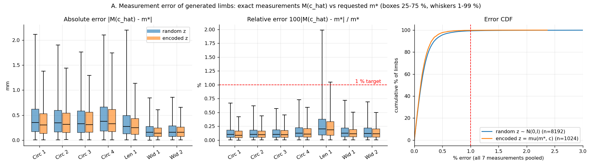
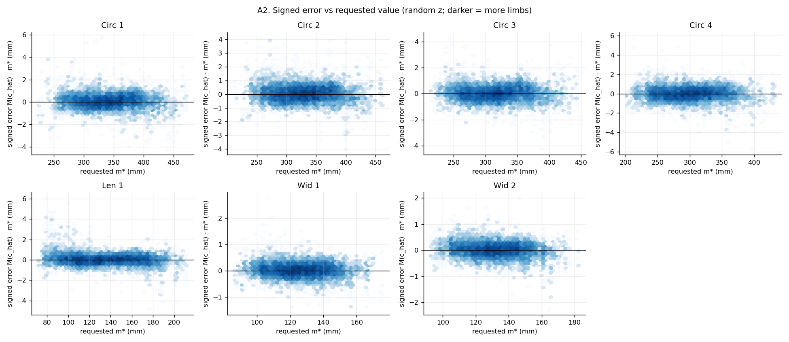
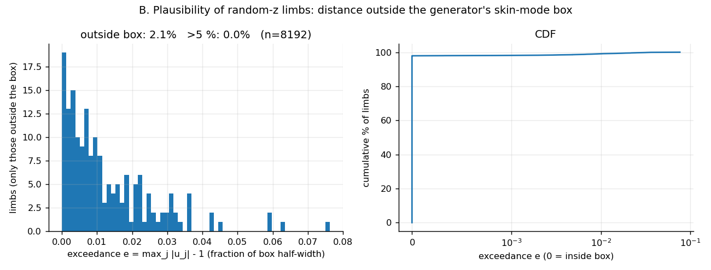
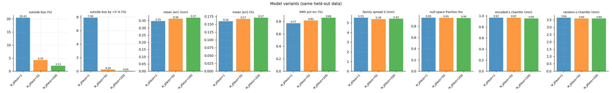
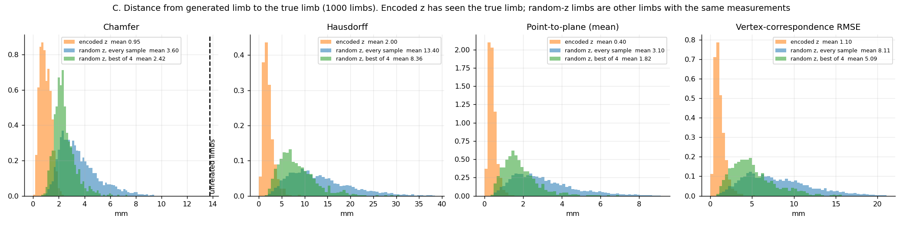
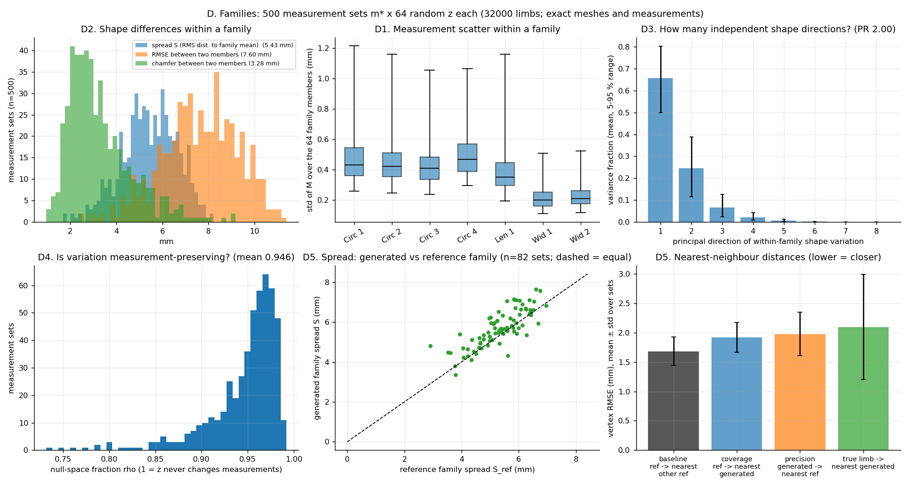
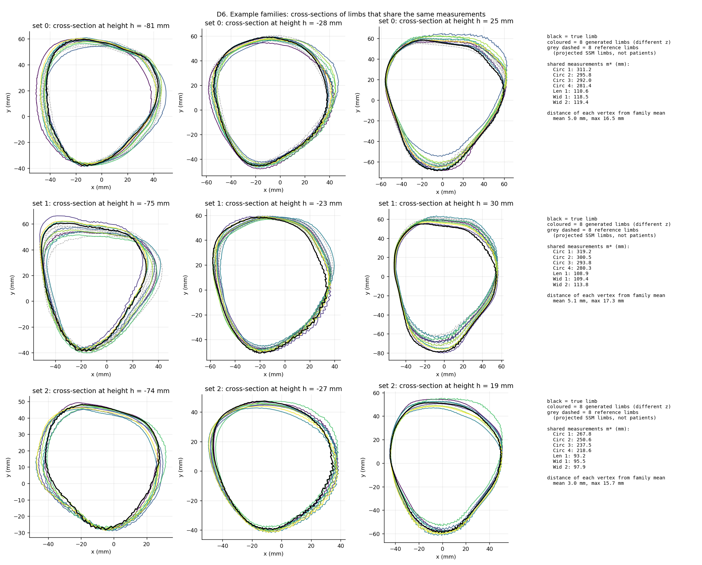
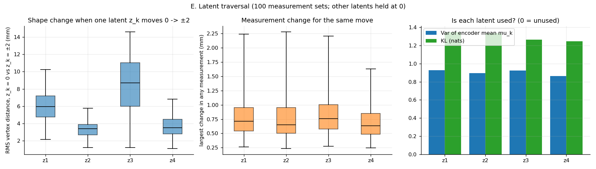

# Generating families of plausible residual limbs from measurements

*A conditional VAE that maps 7 limb measurements to the 10 SSM components + scale factor, evaluated against the original OpenLimbTT generator and `SSM_Driver.py` measurement system.*

Everything lives in `claude/`; no existing file was modified except `pyproject.toml`/`uv.lock` (dependencies added at your request).

---

## 1. Summary

| | result (final model, `w_plaus=200`) |
|---|---|
| Measurement accuracy, 8192 generated limbs vs requested (original code) | **0.37 mm mean abs error, 0.17 % mean, 0.86 % at the 99th percentile** (target ≈ 1 % / 5 mm) |
| Worst single samples | 5.8 mm on a circumference (2.7 %); 6.1 mm on Length 1 (7.6 %, on a short ≈ 80 mm limb) — see §5.1 |
| Shape distance to the true limb when `z` is inferred from it (1000 limbs) | chamfer **0.95 mm**, Hausdorff 2.0 mm, point-to-plane 0.40 mm |
| Same measurements, different `z` (500 sets × 64 = 32 000 limbs) | measurements move by only **0.4 mm** (std over `z`) while the shape moves **5.4 mm RMS** per vertex (7.6 mm between two samples, chamfer 3.3 mm) |
| Plausibility (generated limb inside the generator's parameter box) | 97.9 % (79.6 % with the initial loss weights) |
| Latent usage | all 4 latent axes active; ~95 % of the variation lies along measurement-preserving directions |

Take-aways: the model reproduces the requested measurements to a small fraction of the target tolerance, it inverts real limbs to ~1 mm, and — importantly for your goal — varying `z` yields genuinely different limbs (not just noise) that all still satisfy the measurements, with a spread comparable to that of real limbs sharing the same measurements.

---

## 2. Problem and approach

Seven measurements (4 circumferences, 1 length, 2 widths; `get_measurement_details`) do not determine the 11 SSM coordinates (10 PCA modes + tibia scale), so the map measurements → limb is one-to-many. A regressor returns the conditional mean; a **conditional VAE** returns a distribution:

```
training   m, c ──► encoder q(z | m, c) ──► z (4 numbers) ──┐
                                                             ├──► decoder p(c | m, z) ──► c_hat (10 modes + scale)
           m ─────────────────────────────────────────────────┘
generation z ~ N(0, I) ────────────────────────────────────────► many limbs, all consistent with the same m
```

`z` is the "small amount of data from the encoder": 4 numbers, equal to the number of leftover degrees of freedom (11 − 7). `model.z_dim=0` degrades to a deterministic MLP.

### What makes it work as a *generator* (not just an autoencoder)
1. **Prior-path losses.** A plain CVAE only sees `z` from the encoder. Here the decoder is additionally run on `z ~ N(0, I)` (there is no ground truth) and penalised if the result (a) doesn't match the measurements (`w_prior_meas`) or (b) leaves the plausible region (`w_plaus`).
2. **Differentiable measurement surrogate.** Exact measurement costs ≈ 4.5 ms per limb (plane/edge intersections on the full mesh). A small MLP `components → measurements` (0.32 mm mean error, 0.1 %) is used inside the loss; **all reported numbers below use the exact original measurement code**.
3. **Exact plausibility test.** `GenerateRandomLimbs.py` draws 10 "skin" modes uniformly from a box and maps them through the linear regression in `LR.pkl`. I extracted that matrix (`data/lr_map.npz`), so any component vector can be mapped back into box coordinates: inside the box ⇔ the generator could have produced it. Used as a hinge penalty and as the metric "outside box".
4. **No stored dataset.** Limbs are sampled on the fly with the same recipe (skin modes ~ U(box) → linear map, scale ~ U(342.8, 439.8)); no docker, no disk. I checked the sampler against docker-generated limbs (max mean difference 0.05 σ, max std ratio error 3 %).

### Training (defaults)
`z_dim=4`, residual MLPs (width 256, depth 4), AdamW, cosine schedule, β = 0.01 (KL, 20-epoch warm-up), 150 epochs × 100 steps × 512 fresh limbs (≈ 7.7 M samples, ≈ 15 min on CPU). Model selection on `val/score = √recon + prior-measurement RMSE + outside-box fraction` on a fixed 512-limb validation set. Configuration via Hydra, training via Lightning; sweeps: `python claude/train.py -m model.z_dim=2,3,4,6 …` or `-m experiment=optuna`.

---

## 3. Evaluation protocol

To be independent of anything I built:
* **Test limbs** (1024) come from the **original docker generator** `GenerateRandomLimbs.py`.
* Every mesh and measurement (true *and* generated) is computed with the **original** `LegMeasurementDataset.get_verts` / `get_measures` (`SSM_Driver.py`), in mm.
* Sample sizes: A/B 8192 prior samples (+1024 posterior); C 1000 limbs; D **500 measurement sets × 64 `z` samples = 32 000 limbs**; E 100 sets.
* Shape distances (chamfer, Hausdorff, point-to-plane) are vertex-sampled: for each vertex the nearest vertex on the other mesh; point-to-plane uses that vertex's normal; symmetrised (chamfer/point-to-plane averaged over both directions, Hausdorff = max).

Reproduce: `python claude/evaluate.py ckpt=<best.ckpt>` then `python claude/plot_eval.py <eval dir> --out claude/report/figs`. Full text reports: `report/eval_reports/`.

---

## 4. Results

### 4.1 Measurement accuracy (A)



Prior samples (`z ~ N(0, I)`, 8192 limbs, final model):

| measure | mean value (mm) | \|err\| mean (mm) | \|err\| std (mm) | \|err\| max (mm) | bias (mm) | % mean | % std | % max |
|---|---|---|---|---|---|---|---|---|
| Circumference 1 | 341.2 | 0.461 | 0.442 | 5.72 | +0.063 | 0.137 | 0.136 | 1.74 |
| Circumference 2 | 330.1 | 0.439 | 0.404 | 4.11 | +0.042 | 0.136 | 0.130 | 1.60 |
| Circumference 3 | 316.2 | 0.420 | 0.381 | 4.30 | +0.009 | 0.134 | 0.124 | 1.75 |
| Circumference 4 | 300.5 | 0.489 | 0.451 | 5.78 | −0.013 | 0.165 | 0.155 | 2.68 |
| Length 1 | 135.2 | 0.379 | 0.423 | 6.06 | +0.045 | 0.304 | 0.408 | 7.64 |
| Width 1 | 126.1 | 0.200 | 0.184 | 2.78 | +0.028 | 0.161 | 0.152 | 2.58 |
| Width 2 | 132.1 | 0.206 | 0.188 | 2.25 | +0.006 | 0.158 | 0.145 | 1.44 |
| **all** | | **0.371** | **0.386** | **6.06** | +0.026 | **0.171** | 0.210 | 7.64 |

Encoder-`z` (posterior) reconstruction is slightly better (0.32 mm, 0.15 %, worst 2.8 mm). There is no measurable bias, and error does not grow with limb size (figure A2):



### 4.2 Plausibility (B)



With the initial loss weight (`w_plaus=1`) **20.4 %** of prior samples fell (mostly marginally) outside the generator's box. Raising the weight fixes this without harming accuracy or diversity:

| `w_plaus` | outside box | outside by > 5 % of half-range | mean \|err\| mm | 99th pct err % | family spread mm | prior chamfer to true limb mm |
|---|---|---|---|---|---|---|
| 1 | 20.4 % | 7.9 % | 0.348 | 0.77 | 5.53 | 3.64 |
| 50 | 4.3 % | 0.26 % | 0.364 | 0.82 | 5.39 | 3.60 |
| **200** | **2.1 %** | **0.05 %** | 0.371 | 0.86 | 5.43 | 3.60 |



The price is small: mean error +0.02 mm and a slightly heavier tail. `generate.py` can additionally resample until every limb is inside the box (`reject_implausible=true`).

### 4.3 Shape agreement with the true limb (C)



Mean ± std over 1000 limbs (mm):

| generated vs the true limb | chamfer | Hausdorff | point-to-plane | point-to-plane (max vertex) | vertex RMSE |
|---|---|---|---|---|---|
| encoder `z` (sees the true limb) | 0.95 ± 0.42 | 2.00 ± 1.09 | 0.40 ± 0.20 | 1.64 ± 0.87 | 1.10 ± 0.62 |
| prior, mean over 4 samples | 3.60 ± 1.61 | 13.40 ± 7.12 | 3.10 ± 1.71 | 12.70 ± 6.98 | 8.11 ± 4.17 |
| prior, best of 4 | 2.42 ± 0.82 | 8.36 ± 4.07 | 1.82 ± 0.90 | 7.72 ± 3.91 | 5.09 ± 2.61 |

For scale: two unrelated limbs are 13.8 mm chamfer apart. The first row shows the model can *represent* the true limb to ~1 mm when the true `z` is available. The prior rows are **not** an accuracy measure — a prior sample is a different limb that happens to share the measurements — but show the family stays in the neighbourhood of the true limb (best-of-4 is within 2.4 mm chamfer).

### 4.4 Does varying `z` give other limbs with the same measurements? (D, E)

500 measurement sets × 64 samples each (32 000 limbs, all measured/meshed with the original code).



**D1 – measurements stay put.** Across the 64 `z` samples of a set the measurements have a std of 0.44–0.50 mm (circumferences), 0.40 mm (length), 0.22 mm (widths); i.e. 0.14–0.32 %.

**D2 – shapes genuinely differ.** RMS vertex deviation from the family mean 5.4 mm (95 % of sets: 3.0–7.5 mm); two samples of the same set are on average 7.6 mm apart (RMSE, largest pair ≈ 20 mm), chamfer 3.3 mm, Hausdorff 12 mm.

**D3 – dimensionality.** The family is essentially 3-D: variance fractions 0.66 / 0.25 / 0.07 / 0.02 (participation ratio 2.0; 3 directions for 95 %). All four latent axes carry information (E below), but the shape effect of the fourth is small.

**D4 – variation is along measurement-preserving directions.** Using the Jacobian of the measurements w.r.t. the components, a mean of **94.6 %** of the within-family variance lies in the 4-D null space (1.0 = `z` never changes the measurements).

**D5 – compared with real limbs sharing the same measurements.** For 82 of 100 sets I built a *reference family* by projecting random in-box limbs onto {measurements = target} (Gauss-Newton on the surrogate; kept only if inside the box and re-verified with the original measurement code to within 1.5 mm; ~91 limbs per set):

| | generated | reference |
|---|---|---|
| spread (RMS vertex deviation from family mean) | 5.72 mm | 5.34 mm |
| coverage (reference limb → nearest generated) | 1.92 mm | density baseline (ref → nearest other ref): 1.68 mm |
| precision (generated → nearest reference) | 1.98 mm | |
| true limb → nearest of the 64 generated | 2.10 mm (95 % of sets 0.85–4.26) | |

So the generated family is ≈ 7 % wider than the reference and covers it almost as densely as the reference covers itself; the true limb has a close neighbour in the family.

**Example families** (black = true limb, colours = 8 generated samples with different `z`, same measurements; cross-sections at three heights):



**E – latent traversal** (z = ±2 along a single axis, 100 sets): every axis changes the shape by 3.3–8.4 mm RMS while the largest measurement change is ≈ 0.7–0.8 mm on average.



---

## 5. Caveats and honest limitations

1. **Tail errors.** The mean is 0.17 %, but the worst of 8192 samples is 7.6 % on Length 1 (6.1 mm on a ≈ 80 mm length), and the 99th percentile is 0.86 %. Length is the smallest measurement, so its percentage error is largest. The maximum grew with `w_plaus` (5.4 % at `w_plaus=1`, 7.6 % at 200): the plausibility constraint can compete with hitting an extreme measurement combination. `reject_implausible=true` plus a post-hoc exact check (the `generate.py` output) removes such cases.
2. **Synthetic test distribution.** All test limbs come from the OpenLimbTT generator (uniform in a box). I have not tested on real scans, whose measurements carry noise and may not be exactly consistent with any point in the model. The model was trained with `meas_noise=0`; if you will feed noisy measurements, train with `model.meas_noise>0` (z-scored units) and re-evaluate.
3. **Family width is not calibrated against a ground truth.** No dataset contains several real limbs with identical measurements. The reference family is a proxy (projected random in-box limbs, not uniformly distributed over the true conditional set), so D5 is a sanity check, not a proof of calibration. The generated family is slightly wider (5.7 vs 5.3 mm) and ~5 % of its variance is off the measurement-preserving directions (which is where the ~0.4 mm measurement scatter comes from). `generate.py temperature<1` narrows it.
4. **Single seed.** Each variant was trained once. The differences between `w_plaus` values in accuracy (0.348 → 0.371 mm) are small and I did not measure seed-to-seed variation, so treat them as indicative; the large effect (outside-box 20 % → 2 %) is unambiguous.
5. **Vertex-sampled shape metrics.** Chamfer/Hausdorff/point-to-plane use mesh vertices (7732 points) rather than exact point-to-triangle distances, which slightly overestimates distances; the meshes share topology so vertex-correspondence RMSE is also reported.
6. **Not compared with your GA/NN runs.** I did not re-run those; the numbers above are against your stated target (≈ 1 % / 5 mm), not a head-to-head. The evaluation script can be pointed at any method that outputs component vectors if you want a like-for-like comparison.
7. Hyper-parameters other than `w_plaus` (β, `z_dim`, width, …) are at their defaults and have not been swept; `experiment=optuna` is provided for that.

---

## 6. Files

| path | purpose |
|---|---|
| `train_surrogate.py` → `data/surrogate_scaled.pt` | stage 1: fit the differentiable measurement surrogate on streamed exact measurements |
| `train.py` | stage 2: train the CVAE (Hydra + Lightning, sweepable) |
| `generate.py` | sample a family for given measurements (mm) → `components.npy`, exact-measurement check, optional `.obj` meshes |
| `evaluate.py`, `plot_eval.py` | independent evaluation vs the original generator/measurement code, and its figures |
| `openlimb_cvae/` | `geometry.py` (efficient geometry, sampler, plausibility box), `data.py`, `lit_cvae.py`, `lit_surrogate.py`, `networks.py` |
| `conf/` | Hydra config groups (`data`, `model`, `trainer`, `logger`, `experiment`) |
| `data/lr_map.npz` | regression matrix extracted from `LR.pkl` (1 KB) |
| `outputs/` | checkpoints, logs and raw evaluation data (`eval_data.npz`) |

Usage example:
```bash
.venv/Scripts/python.exe claude/generate.py ckpt=claude/outputs/single/2026-09-29_15-42-26/checkpoints/best.ckpt \
    measurements=[300,290,280,270,120,110,115] n_samples=32 save_meshes=true
```
